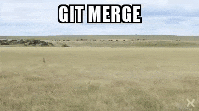

<p align="center">
  
</p>

<h1 align="center"><b>Git tips + cheat sheet</b></h1>
<p align="center">Handige spiekbrief om je Git workflow te verbeteren.</p>

## Content

- [Standaard workflow](#standaard-workflow)
- [Wat is Git](#wat-is-git)
- [Gitignore](#de-gitignore)
- [Begrippen](#enkele-belangrijke-begrippen)

## Standaard Workflow

#### 1. Repository Initialiseren (één keer per project):
In de lokale folder van het project:

##### Als je een nieuw project start: 
```shell
$ git init
Initialized empty Git repository in ...
```

##### Als je een bestaand project ophaalt vanaf een remote repository: 
```shell
$ git clone <url_van_de_repository>
```

#### 2. Schakelen naar een branch (bijv. feature/bugfix/hotfix/...) :

Werken met branches in Git is essentieel voor een efficiënte en georganiseerde workflow, vooral bij projecten met meerdere ontwikkelaars.

##### Nieuwe lokale Branch Maken: Voor elke nieuwe feature of bugfix maak je een nieuwe branch aan:

**syntax:**
```shell
$ git checkout -b <naam_van_de_branch>
```

**voorbeeld:**
```shell
$ git checkout -b feature/nieuwe-grafiek # creeërt nieuw branch en schakelt er direct naar over
```

*tip: de feature/ bugfix/ hotfix/ in de branchnaam zijn niet nodig maar maken het meer duidelijk wat de branch inhoudt*

**LET OP**: als je een **nieuwe** branch aanmaakt gebruik je de checkout parameter `-b`

##### Switchen naar een bestaande Branch:
Wil je werken aan code in een al bestaande branch, dan moet je hiernaar omschakelen.

**voorbeeld:**
```shell
$ git checkout feature/updaten-grafiek # schakelt over naar een bestaande branch
```

Bestaat de branch al wel maar heb je deze nog niet lokaal opgehaald? Gebruik dan eerst het `git fetch origin` commando om laatste branches op te halen.

**voorbeeld:**
```shell
$ git fetch origin

a1e8fb5..45e66a4 main -> origin/main
a1e8fb5..9e8ab1c develop -> origin/develop
* [new branch] some-feature -> origin/some-feature

$ git checkout -b some-feature origin/some-feature # hiermee creeër je lokaal een nieuwe branch 'some-feature' die gelijk is aan de remote branch some-feature
```

#### 3. Gewijzigde bestanden toevoegen:
Bewerk je bestanden en voeg de gewijzigde bestanden toe aan de staging area:

```shell
$ git add <bestandsnaam>     # Voegt een specifiek bestand toe
$ git add .                  # Voegt alle gewijzigde bestanden toe
```

#### 4. Wijzigingen opslaan in lokale git repository:
 Sla de wijzigingen op in je lokale repository met een duidelijke commit message:
```shell
$ git commit -m "Beschrijving van de wijzigingen"
```

#### 5. Uploadt de lokale commits naar de remote repository:
Branch Pushen naar Remote: Om na een commit de lokale branch beschikbaar te maken op de remote repository gebruik je het `git push` commando:
```shell
$ git push
```

**LET OP:** krijg je na een `git push` de error 
```sh 
$ git push
fatal the current branch main has no upstream branch ...
```
Dit betekent dat betekent dat je lokale main branch niet is gekoppeld aan een corresponderende branch in een remote repository
meestal `origin`

Om dit op te lossen voer je het volgende commando uit:
```sh
$ git config --global --add --bool push.autoSetupRemote true
```

**LET OP:**
-
Het is handig om iedere keer als je begint met het wijzigen van code binnen een branch, eerst de nieuwste wijzigingen op te halen:
```shell
$ git status # checken op welke branch je zit en of er nog lokale wijzigingen open staan en of je deze mee wilt nemen (commit).

# eventueel:
# Het is goed om je lokale wijzigingen te committen voordat je git pull uitvoert, maar alleen als je daadwerkelijk wijzigingen hebt die 
# je wilt bewaren. Als je nog geen relevante wijzigingen hebt gemaakt, is deze stap overbodig. Het -am argument combineert git add en git commit in één commando, 
# wat handig is voor het committen van reeds getrackte bestanden.
$ git commit -am "message"

$ git pull origin <naam_van_branch> # nieuwste code ophalen vanuit de remote git omgeving
```

## Wat is Git?
Git is een versiebeheersysteem dat je helpt bij het bijhouden van wijzigingen in bestanden, meestal in de context van softwareontwikkeling. Zie het als een soort "logboek" voor je projecten, waarin elke aanpassing wordt vastgelegd. Dit is handig om verschillende redenen:

- **Wijzigingen bijhouden**: Git registreert elke wijziging die je in je code aanbrengt. Je kunt zien wie wat wanneer heeft veranderd.

- **Teruggaan naar eerdere versies**: Als er iets misgaat na een wijziging, kun je eenvoudig terugkeren naar een eerdere, werkende versie van je project.

- **Samenwerken**: Git maakt het makkelijker voor meerdere mensen om aan hetzelfde project te werken, zonder dat bestanden overschreven worden of er conflicten ontstaan.

#### Een simpele vergelijking:
Stel je voor dat je een boek schrijft. Zonder Git zou je steeds nieuwe bestanden moeten opslaan: "Boek_concept1", "Boek_concept2", "Boek_definitief". Met Git kun je gewoon in één bestand werken en houdt Git alle versies voor je bij. Je kunt zelfs verschillende versies tegelijkertijd bewerken (via branches) en ze later weer samenvoegen.

> standaard git workflow schematisch weergegeven


### Enkele belangrijke begrippen
- **Repository (repo)**: Dit is de opslagplaats voor je project, inclusief alle bestanden en de geschiedenis van de wijzigingen.

- **Commit**: Een lokale snapshot van je project op een bepaald moment. Elke commit heeft een bericht waarin je beschrijft wat je hebt veranderd.

- **Branch**: Een aftakking van je project, waar je onafhankelijk van de hoofdlijn aan bepaalde wijzigingen kunt werken.<br><br>


- **Merge**: Het samenvoegen van een branch met een andere branch (meestal de hoofd-branche).

## Gitignore
Een `.gitignore`-bestand is een tekstbestand in een Git-repository dat aangeeft welke bestanden of mappen Git moet negeren. Dit is handig om bestanden die niet relevant zijn voor de versiebeheersing (zoals tijdelijke bestanden, logbestanden, of bestanden met gevoelige informatie) buiten de repository te houden.

**Voordelen van een `.gitignore`-bestand**:

*   Houdt de repository **schoon** door onnodige bestanden te vermijden.
*   Verbetert de **prestaties** van Git door irrelevante bestanden te negeren.
*   Beschermt **gevoelige informatie** door deze buiten de repository te houden.
*   Voorkomt **conflicten** door automatisch gegenereerde bestanden en omgevingsverschillen.
*   **Bespaart opslagruimte** door onnodige bestanden niet op te slaan.

Voorbeeld van een gitignore voor een standaard Javascript project: 

```
node_modules/
.DS_Store
*.log
npm-debug.log*
.env
dist/
build/
```

## Handige Git Commando's

Deze lijst bevat handige Git commando's met een omschrijving, ideaal om Git beter te leren begrijpen.

### Basiscommando's (Werken met lokale repositories)

*   `git init`: Initialiseert een nieuwe Git repository in de huidige map.
*   `git clone <url>`: Kopieert een bestaande repository van een externe locatie.
*   `git add <bestand(en)>`: Voegt wijzigingen toe aan de "staging area". Gebruik `git add .` voor alle gewijzigde bestanden.
*   `git commit -m "<bericht>"`: Legt de wijzigingen vast met een beschrijvend bericht.
*   `git status`: Toont de status van de werkdirectory en de staging area.
*   `git log`: Toont een overzicht van alle commits.
*   `git config --global user.name "<naam>"`: Stelt je naam in voor Git.
*   `git config --global user.email "<emailadres>"`: Stelt je e-mailadres in voor Git.

### Branching en Merging (Werken met branches)

*   `git branch`: Toont een lijst van alle branches.
*   `git branch <naam>`: Maakt een nieuwe branch.
*   `git checkout <naam>`: Schakelt over naar een branch.
*   `git checkout -b <naam>`: Maakt een nieuwe branch en schakelt er direct naar over.
*   `git merge <naam>`: Voegt wijzigingen van een branch samen met de huidige branch.
*   `git branch -d <naam>`: Verwijdert een branch (alleen als deze is gemerged).
*   `git branch -D <naam>`: Verwijdert een branch geforceerd.

### Werken met remote repositories

*   `git remote add origin <url>`: Voegt een remote repository toe.
*   `git push origin <branch>`: Pusht commits naar de remote repository.
*   `git pull origin <branch>`: Pullt wijzigingen van de remote repository en voegt ze samen.
*   `git fetch`: Haalt de laatste informatie van de remote repository op.
*   `git remote -v`: Toont een lijst van remote repositories.

### Overige handige commando's

*   `git stash`: Parkeert tijdelijk niet-gecommitteerde wijzigingen.
*   `git stash pop`: Haalt geparkeerde wijzigingen weer terug.
*   `git diff`: Toont de verschillen tussen bestanden.
*   `git reset <commit>`: Reset de huidige branch naar een eerdere commit.
*   `git rm <bestand>`: Verwijdert een bestand uit de repository.

## Grappig plaatje

